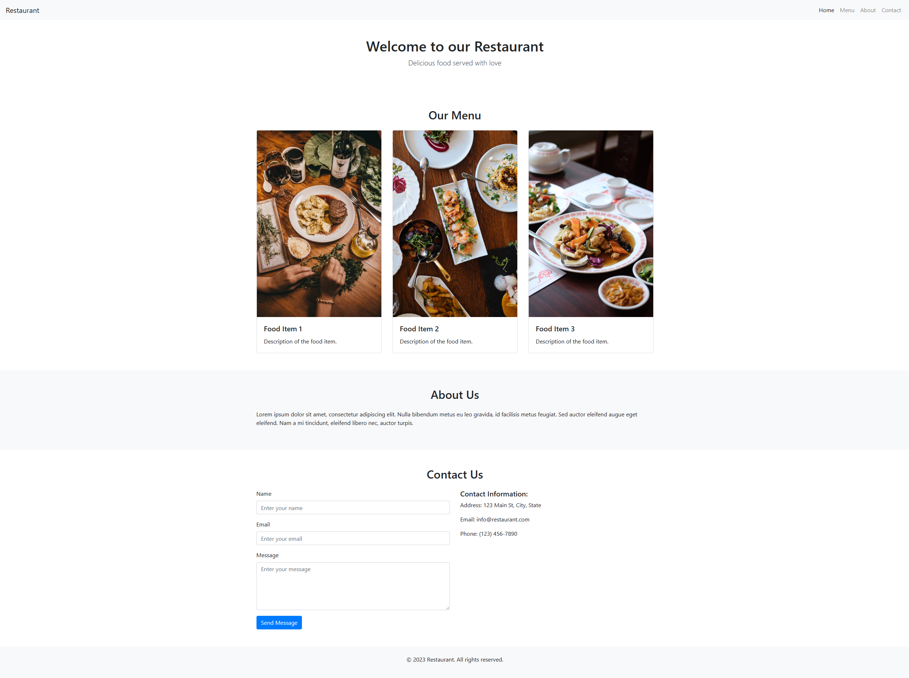

# Restaurant Website Template

This is a responsive single-page restaurant website template created using HTML and Bootstrap. It provides a sleek and modern design for showcasing a restaurant's menu, information, and contact details.

## Features

- Responsive layout that adapts to different screen sizes, ensuring optimal viewing experience on all devices.
- Navigation menu with smooth scrolling functionality for easy navigation within the page.
- Home section with a welcoming message to greet visitors and create a positive first impression.
- Menu section to showcase featured food items, including images, titles, and descriptions.
- About section to provide information about the restaurant, its history, and its values.
- Contact section with a contact form for visitors to reach out and a section displaying contact information.
- Footer section with copyright information.

## Usage

To use this template, simply download the source code files and customize them according to your restaurant's branding and content. You can modify the text, images, and colors to match your requirements. 

The template is built with HTML and utilizes Bootstrap for responsive design and styling. Make sure to have the necessary dependencies (Bootstrap CSS and JavaScript) included in your project.

## Preview

## Tutorial Video

For a step-by-step tutorial on how to use this template and customize it for your restaurant, check out the [tutorial video on YouTube](https://www.youtube.com/watch?v=YOUR_TUTORIAL_VIDEO_ID).

## Credits

This template was created with the help of ChatGPT, an AI language model developed by OpenAI.

## License

This template is released under the [MIT License](LICENSE).

Feel free to use this template for personal and commercial projects. Attribution is not required, but it is appreciated.
